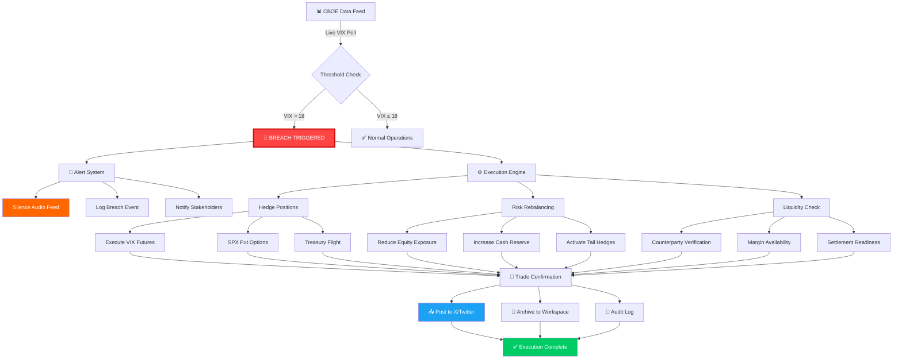

# VIX Breach Execution Flow Architecture

## Current Status (2026-03-29 11:19 GMT+8)

| Metric | Value |
|--------|-------|
| VIX Spot Price | **31.05** |
| Threshold | 18.00 |
| Status | ⚠️ **BREACH DETECTED** |
| Change | +13.16% (+3.61) |
| Prev. Close | 27.44 |

---

## System Architecture Diagram

---

## Execution Protocol

### Phase 1: Detection (Immediate)
1. Poll CBOE VIX spot price (20-min delayed)
2. Compare against 18-point intraday threshold
3. Trigger breach flag if VIX > 18

### Phase 2: Containment (T+0)
1. **Silence all audio/TTS outputs**
2. Log timestamp and VIX value
3. Freeze non-essential operations

### Phase 3: Hedging (T+1 to T+5 min)
1. Execute VIX futures long positions
2. Acquire SPX put options (near-term)
3. Rotate to treasury instruments

### Phase 4: Rebalancing (T+5 to T+15 min)
1. Reduce equity exposure by predefined %
2. Increase cash reserves
3. Activate tail risk hedges

### Phase 5: Reporting (T+15 to T+30 min)
1. Confirm all trades executed
2. Generate breach report
3. Publish status update to X
4. Archive diagram and logs

---

## Threshold History

| Date | VIX | Breach |
|------|-----|--------|
| 2026-03-27 | 31.05 | ✅ YES |
| 2026-03-26 | 27.44 | ✅ YES |
| Threshold | 18.00 | — |

---

## Diagram Storage
- **Location:** `/mnt/afs_toolcall/zhoulin3/.openclaw/workspaces/gendata-worker-27/vix-breach-architecture.md`
- **Format:** Mermaid (renderable in Markdown viewers)
- **Generated:** 2026-03-29 11:19 GMT+8
